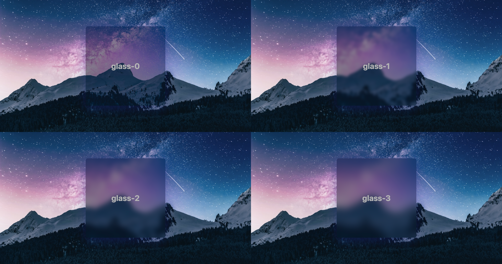

# @bebeal/tailwind-glass

A Tailwind CSS plugin that adds a glass-like frosted transparency effect to any element.

<kbd>
  <div align="center">
    
  </div>
</kbd>

## Installation

```bash
npm install @bebeal/tailwind-glass --save-dev
```

## Usage

### Tailwind v3
Add the plugin to your Tailwind configuration:

```ts
// tailwind.config.ts
import type { Config } from 'tailwindcss'
import GlassPlugin from '@bebeal/tailwind-glass'

export default {
  theme: {
    // ...
  },
  plugins: [
    GlassPlugin,
  ],
} satisfies Config
```

### Tailwind v4
Use the `@plugin` directive in your css file:

```css
@plugin '@bebeal/tailwind-glass';
```

### Available Classes

- `glass-{spacing}`

### Example

```tsx
<div className="bg-[url('https://images.unsplash.com/photo-1519681393784-d120267933ba?ixid=MnwxMjA3fDB8MHxwaG90by1wYWdlfHx8fGVufDB8fHx8&ixlib=rb-1.2.1&auto=format&fit=crop&w=1124&q=100')] bg-contain bg-no-repeat bg-center">
  <div className="glass-2 h-[15rem] w-[20rem] rounded-md" />
</div>
```

## License

MIT
